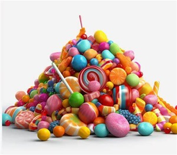
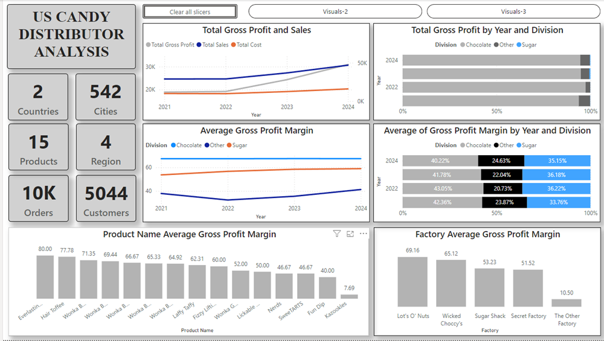
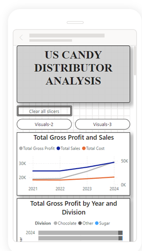
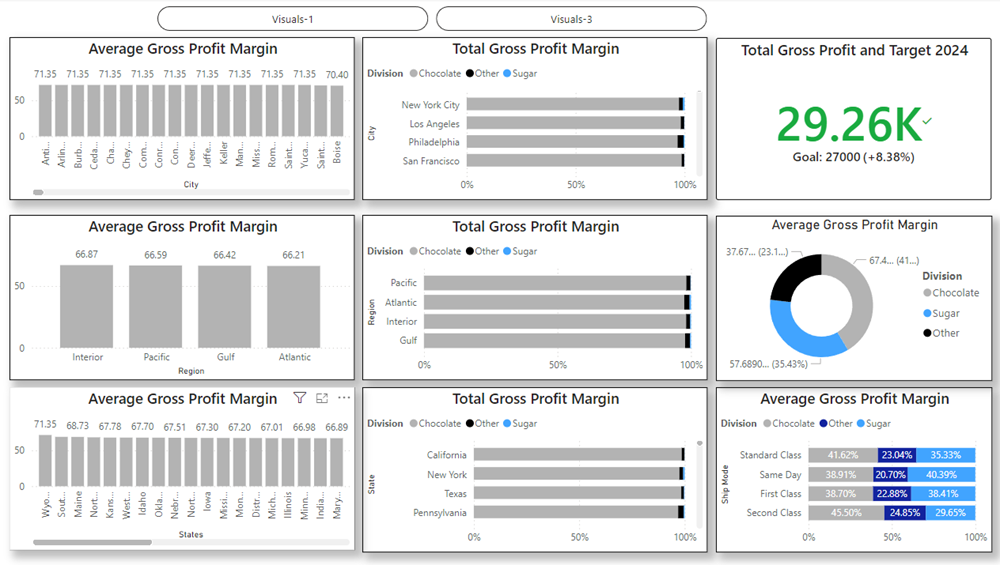
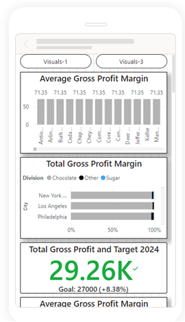
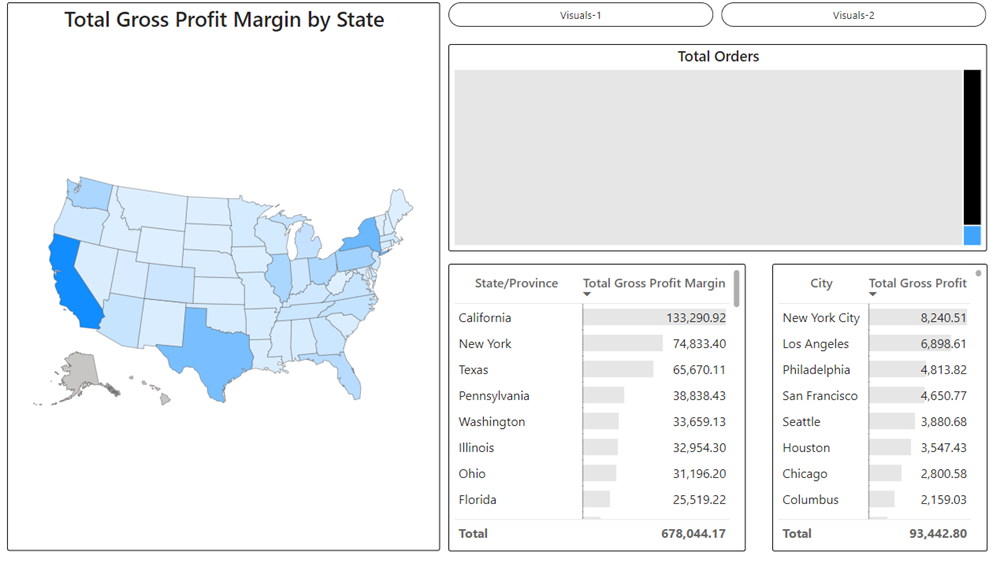
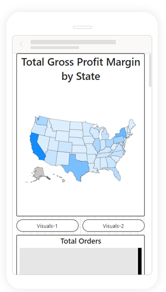

## **US CANDY DISTRIBUTOR ANALYSIS**

### **Steps taken**
- Data loading and transformation
- Feeature engineering;
    - Creating calculated columns
    - Creating calculated tables
- Exploratore data analysis (EDA)
- Plotting visuals and refinement of viusals
- Drawing observations and conclusions from visualisations

### **Observations**
- Chocolate has the highest gross profit percentage over the years
- Chocolate has the highest gross profit margin percentage contribution over years 2021 - 2024
- Everlasting Gobstopper has the highest averge gross profit margin
- Lot's O' Nuts has the highest average gross profit margin
- Antoch and some other cities have the same average gross profit margin; 71.35
- Interior has the highest average gross profit margin in the regions; 66.87
- In states, Wyoming has the highest average gross profit margin; 71.35
- Chocolate makes up the highest percentage of total Gross profit margin in cities, regions and states
- Chocolate has the highest percentage of average gross profit margin in ship mode except for same day where Sugar is more than it
- Chocolate has the highest average gross profit margin distribution as shown in the doughnut chart
- In 2024, only chocolate reached and surpassed its target; 27,000, with a value of 29,262.84

### **Some images from PowerBI**

**Desktop and Mobile**
 

 

 
